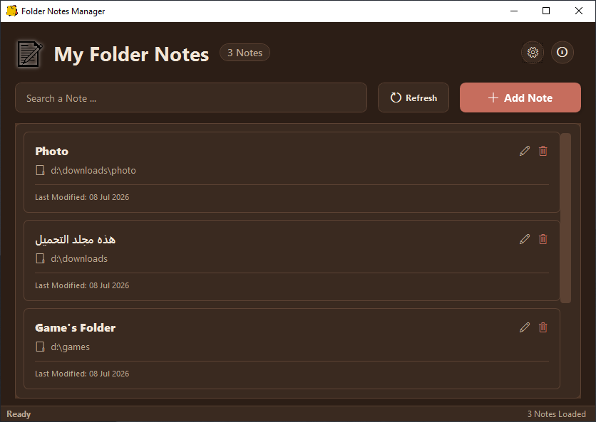
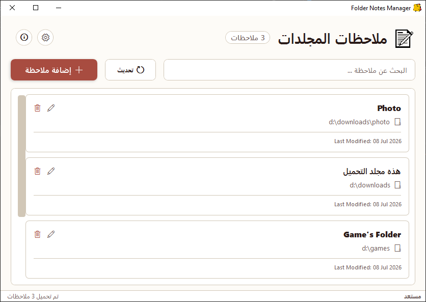
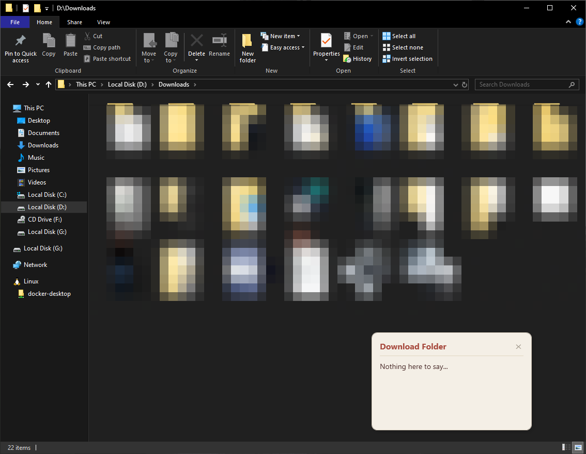
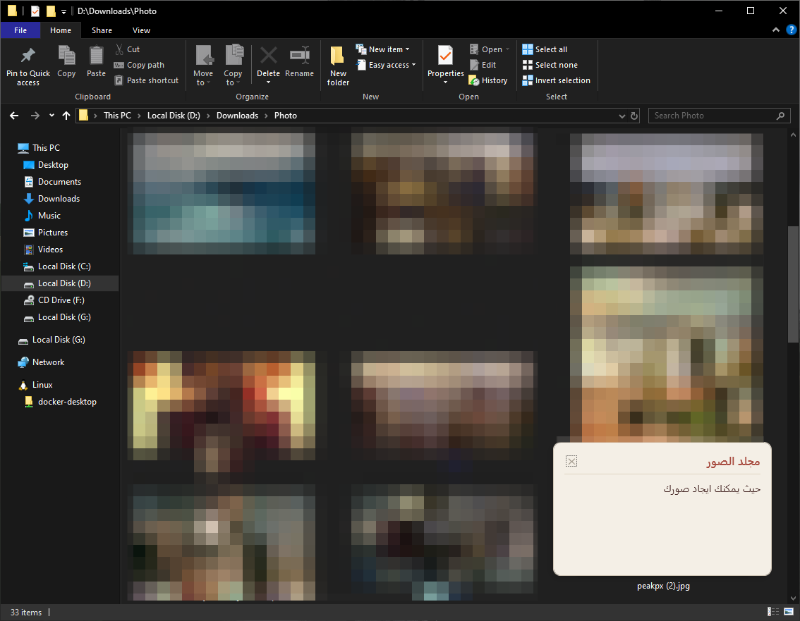

<div align="center">

# Folder Notifier

[](https://dotnet.microsoft.com/)
[](https://learn.microsoft.com/dotnet/desktop/wpf/)
[](https://github.com/AliAl-ojeely)
[](LICENSE)
[](https://github.com/AliAl-ojeely)

</div>

---

## What is Folder Notifier?

<div align="center">


</div>

<br>

**Folder Notifier** is a lightweight Windows desktop application built with **WPF (.NET 8)** that lets you attach notes to any folder on your computer.

Whenever that folder is opened through **Windows File Explorer**, the application automatically displays the linked note as a floating popup.

The application runs quietly in the background from the **System Tray**, requires no internet connection, and stores everything locally using **SQLite**.

> **Important:** Folder Notifier only displays notes associated with folders. It does **not** modify your files or folders in any way.

---

## Features

* **Folder-based Notes** – Attach notes to any folder on your Windows system.
* **Context Menu Integration** – Trigger notes directly from the Windows right-click menu ("Show Folder Note").
* **Optional Auto-Popup** – Full control over whether notes appear automatically or only upon user request.
* **Settings & Personalization** – Easily customize your language and toggle between Light/Dark Mode.
* **Runs in Background** – Resides silently in the Windows System Tray.
* **Smart Folder Monitoring** – Efficient Explorer detection with near-zero CPU usage.
* **Bilingual UI** – Full English & Arabic support.
* **RTL/LTR Support** – The UI automatically adjusts layout based on the selected language.
* **SQLite Database** – Notes are stored securely and locally inside your AppData folder.
* **Modern Popup Windows** – Custom message windows replacing legacy dialogs.
* **Floating Notes** – Draggable, "Always-on-Top" notes that remember their screen position.
* **Privacy First** – Zero telemetry, no analytics, no cloud synchronization.
* **Completely Offline** – Internet connection is never required.

---

<div align="center">



</div>

<br>

---

## Inno Setup script

If you want to take a look at the Folder Notifier Setup Script, here is the Repo for Inno Setup Scripts:

```bash
https://github.com/AliAl-ojeely/InnoSetup-Game-Installer-Template/tree/main
```

You will find it under the FolderNotifier.iss name file

---

## Installation

### Download Release

Download the latest version from the project's **Releases** page.

Supported Platform:

- Windows x64

---

### Build From Source

```bash
git clone https://github.com/AliAl-ojeely/FolderNotifier.git

cd FolderNotifier

dotnet restore

dotnet build

dotnet run
```

Requirements

- .NET 8 SDK
- Windows 10 / Windows 11

---

<div align="center">



</div>

<br>

---

## Project Structure

```text
FolderNotifier
│
├── Assets
│   ├── icon.ico
│   ├── notes.png
│   ├── main-page-en.png
│   ├── main-page-ar.png
│   ├── message-note-en.png
│   └── message-note-ar.png
│
├── Data
│   ├── AppDbContext.cs
│   └── DatabaseInitializer.cs
│
├── Models
│   └── AppNote.cs
│
├── Services/
│   ├── DatabaseService.cs
│   ├── ExplorerHelper.cs
│   ├── Languages.cs
│   ├── ShellWatcherService.cs
│   ├── SettingsService.cs
│   ├── ThemeManager.cs
│   └── ContextMenuService.cs
│
├── Views/
│   ├── AddNoteWindow.xaml
│   ├── CustomMessageBox.xaml
│   ├── DeveloperInfo.xaml
│   ├── MainWindow.xaml
│   ├── SettingsWindow.xaml
│   └── NoteWindow.xaml
│
├── App.xaml
├── App.xaml.cs
├── AppSettings.cs
├── FolderNotifier.csproj
├── README.md
└── .gitignore
```

---

## Usage

Launch the application.

Create a new note.

Choose the folder you want to monitor.

Save the note.

Minimize the application to the System Tray.

Whenever the selected folder is opened from Windows Explorer, the note will automatically appear.

---

<div align="center">



</div>

<br>

---

<div align="center">



</div>

<br>

---

## Technologies

- .NET 8
- WPF
- C#
- SQLite
- Entity Framework Core
- Hardcodet.NotifyIcon.Wpf
- Windows Shell API

---

## Future Improvements

- Folder groups
- Rich text notes
- Attachments
- Reminder scheduling
- Search functionality
- Backup & Restore
- Dark / Light themes
- Markdown support

---

## Contributing

Contributions are welcome.

You can help by:

- Reporting bugs
- Suggesting new features
- Improving translations
- Optimizing the codebase
- Creating pull requests

---

## Developer & Contact

**Ali Nasser Al-ojeely (Mr.Ghost)**  
*Frontend & Desktop Application Developer*

[](https://github.com/AliAl-ojeely)

[](mailto:alialojeely@gmail.com)

If you have any suggestions, encounter bugs, or want to contribute, feel free to open an issue or reach out directly.
